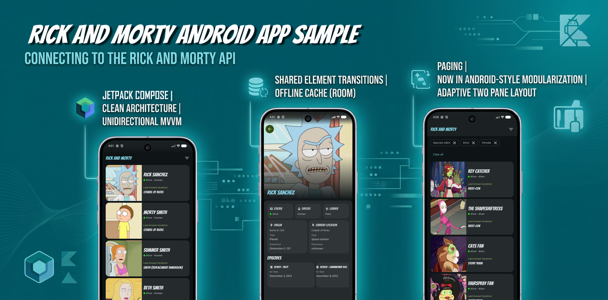
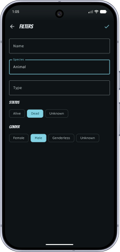
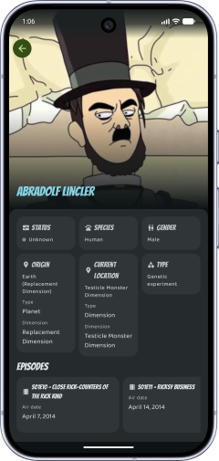

# RickAndMorty-Android-Playground

A native Android app for browsing characters from the [Rick and Morty API](https://rickandmortyapi.com/),
built with Jetpack Compose and a fully modularized, offline-first architecture.

Ported from a sibling Kotlin Multiplatform project built with Compose Multiplatform, this app exists to
be a playground for Android-only APIs the multiplatform stack doesn't expose — starting with
`NavigableListDetailPaneScaffold`, unavailable in Compose Multiplatform, which replaces the
manually-wired `ListDetailPaneScaffold` + `PredictiveBackHandler` the original app needed.

## Screenshots

   

Adaptive two-pane list/detail layout on expanded-width windows (tablets, landscape):


## Features

- **Character list** with endless scrolling backed by Paging 3 and a `RemoteMediator`,
  so pages are fetched from the network, cached in a local database, and served from there.
  Pull-to-refresh forces a fresh fetch, bypassing the HTTP cache.
- **Filtering** by name, species, type, status, and gender. Active filters show as
  dismissable chips with a *Clear all* shortcut; filter state is persisted in the database.
- **Character detail** screen with a collapsing hero image, status/species/gender cards,
  origin & current-location details, and an episode carousel.
- **Adaptive two-pane layout**: on expanded-width windows (tablets, landscape) the list and
  detail are shown side by side; on compact widths the detail is a separate screen with a
  shared-element image transition. In that single-pane mode, swiping left/right on the detail
  switches between characters, keeping the selection in sync with the list.
- **Offline-first**: the Room database is the single source of truth, so previously loaded
  content is available without a network connection.

## Architecture

The app follows a modularized, Now-in-Android-style structure with a clean
`data → domain → ui` layering inside each feature and unidirectional MVVM in the UI layer.

### Module graph

```
:app (umbrella: App, navigation, DI aggregation, MainActivity)
  │
  ├──► :feature:characters:impl ──► :feature:characters:api
  │                            ├──► :feature:episode:api
  │                            └──► :feature:location:api
  │
  ├──► :feature:episode:impl ──► :feature:episode:api
  ├──► :feature:location:impl ──► :feature:location:api
  │
  └──► :core:designsystem, :core:network, :core:database,
       :core:image, :core:common
```

Each feature is split into **api** (domain models + repository interfaces) and **impl**
(data layer, DI, and — for characters — UI). `:feature:characters:impl` depends only on
**api** modules of other features, so cross-feature data-layer coupling is enforced at compile time.

| Module | Responsibility |
| --- | --- |
| `:app` | Umbrella module: `App` composable, type-safe navigation, `initKoin` aggregation, `MainActivity`. |
| `:feature:characters:api` | Domain models (`Character`, `CharacterDetail`, …) and `CharactersRepository`. |
| `:feature:characters:impl` | Use cases, data layer, Compose UI, ViewModels, and Koin module. |
| `:feature:episode:api` / `:feature:location:api` | Domain models and repository interfaces. |
| `:feature:episode:impl` / `:feature:location:impl` | Data sources, repository implementations, mappers, and Koin modules. |
| `:core:common` | `Result`/`DataError` result types, shared domain models, `AppBuildConfig`. |
| `:core:network` | Ktor `HttpClient` factory, `safeCall` wrapper, and the network Koin module. |
| `:core:database` | Room database, all entities/DAOs/converters (KSP runs only here), and the database Koin module. |
| `:core:designsystem` | Material 3 theme, shared UI helpers, and the error-string/font resources. |
| `:core:image` | Coil image loader configuration. |
| `build-logic` | Gradle convention plugins that keep each module's build script minimal. |

### Build logic (convention plugins)

Shared Gradle setup lives in the `build-logic` included build as precompiled convention plugins,
so a module's build file is typically just a plugin id plus its dependencies:

- `rickandmorty.android.library` — Android library target, namespace, unit tests, lint.
- `rickandmorty.android.feature` — the above plus Compose, Koin, and lifecycle for UI **impl** modules.
- `rickandmorty.android.compose` — Compose BOM + core artifacts, layered onto whichever base Android
  plugin the consumer already applied.
- `rickandmorty.android.application` — for `:app`.
- `rickandmorty.room` — Room + KSP wiring.
- `rickandmorty.lint` — kotlinter + detekt.

### Data flow

```
UI (Compose screen)
  → ViewModel (StateFlow / Paging flow)
    → UseCase
      → Repository (interface in domain, impl in data)
        → Remote data source (Ktor)  → API
        └ Local data source (Room DAO) → SQLite   ◄── single source of truth
```

The list uses a Paging 3 `RemoteMediator`: the UI observes a `PagingSource` over the Room
database, while the mediator fetches from the network and writes into the database on demand.

## Tech stack

| Concern | Library |
| --- | --- |
| UI | Jetpack Compose, Material 3 |
| DI | Koin |
| Networking | Ktor client (kotlinx.serialization) |
| Persistence | Room + SQLite (bundled driver) |
| Paging | AndroidX Paging 3 (with `RemoteMediator`) |
| Images | Coil 3 (Ktor fetcher) |
| Navigation | Compose Navigation (type-safe routes) |
| Async | Kotlin Coroutines / Flow |
| Quality | kotlinter, detekt |
| Build | Gradle convention plugins, version catalog |

## Building & running

Requirements: JDK 17+, the Android SDK (compileSdk 37).

```bash
./gradlew :app:installDebug
```

or open the project in Android Studio and run the `app` configuration.

## Testing

Unit and UI (Robolectric) tests run on the JVM host across all modules:

```bash
./gradlew test
```

## Code quality

```bash
./gradlew formatKotlin        # auto-fix formatting
./gradlew lintKotlin detekt   # verify style
```
